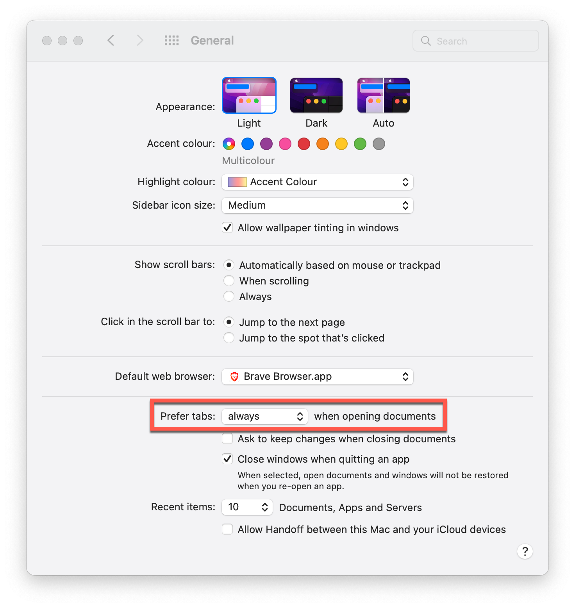
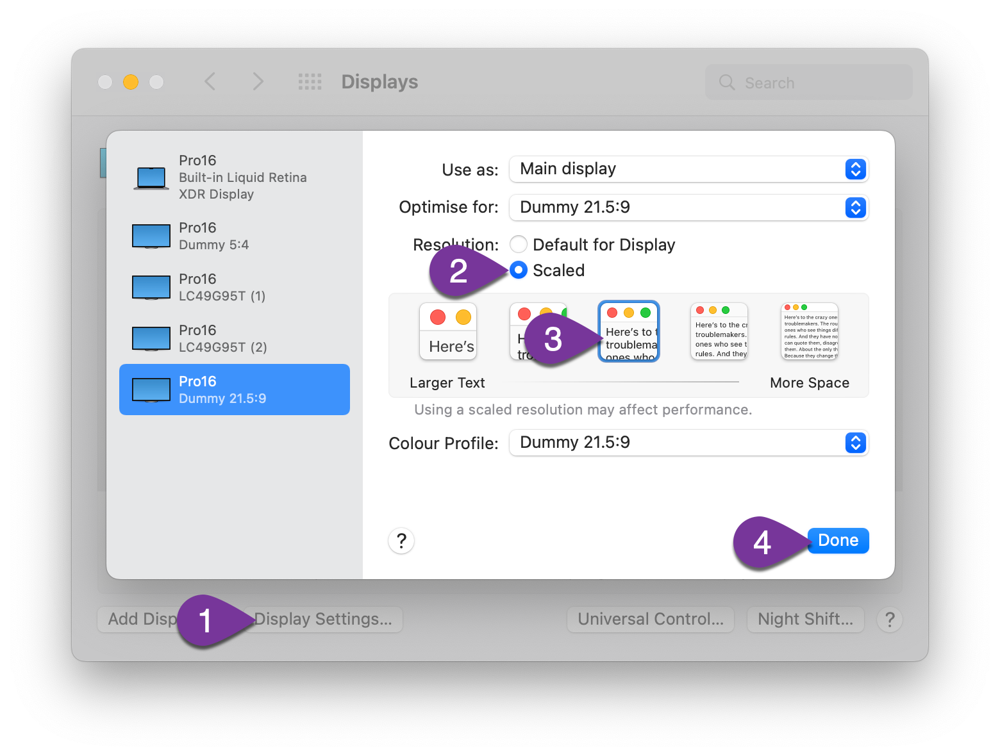
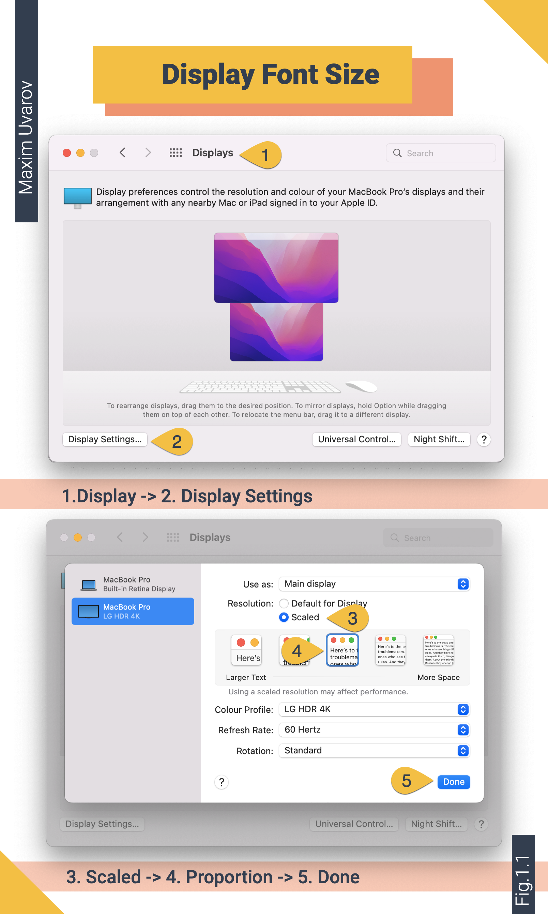
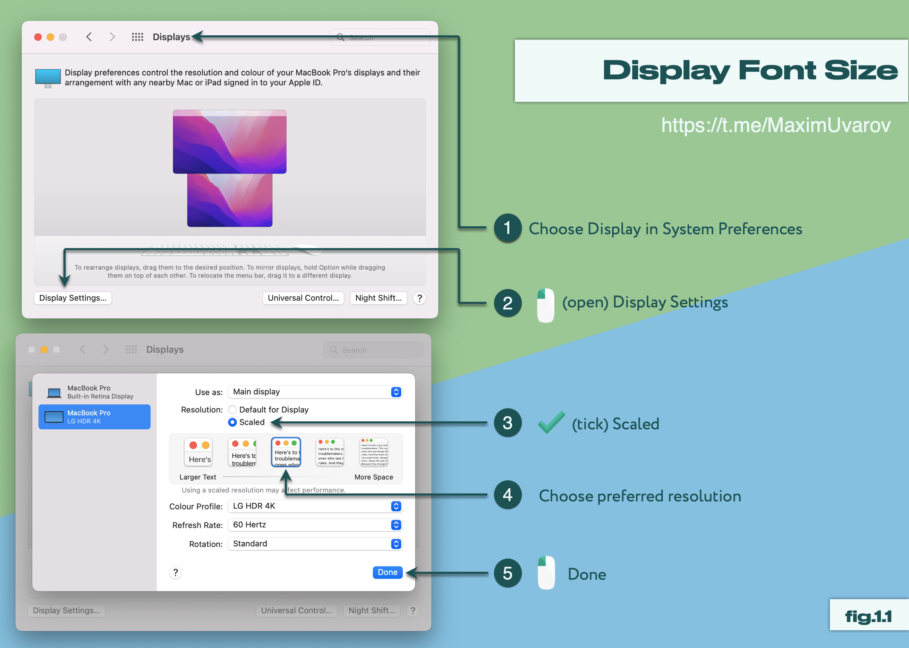

- About the author
  collapsed:: true
	- Maxim Uvarov   [maxim-uvarov.com](https://maximuvarov.com)
	  collapsed:: true
		- Work experience
		  collapsed:: true
			- i-Media - 2010
			- Wikimart - 2011-2012
			- K50 - 2013-2015
			- [NeedForData.ru](https://needfordata.ru/) - 2016 - present
		- Consulting
		  collapsed:: true
			- Ozon [https://www.ozon.ru/](https://www.ozon.ru/)
			- Litres [https://www.litres.ru/](https://www.litres.ru/)
			- Ostrovok [https://ostrovok.ru/?sid=72f31b5b-4853-4b75-b182-2bf81903631d](https://ostrovok.ru/?sid=72f31b5b-4853-4b75-b182-2bf81903631d)
			- Others
		- Open source projects' author
		  collapsed:: true
			- marketing-wiki.ru   [marketing-wiki.ru/wiki/Marketing-wiki.ru](marketing-wiki.ru/wiki/Marketing-wiki.ru)
			- PQYandexMetrika   [github.com/40-02/PQYandexMetrika](github.com/40-02/PQYandexMetrika)
			- PQGoogleAnalytics   [github.com/maxim-uvarov/PQGoogleAnalytics](github.com/maxim-uvarov/PQGoogleAnalytics)
		- Excel and Power BI lecturer in needfordata.ru [needfordata.ru/](needfordata.ru/)
		- Other
		  collapsed:: true
			- Co-founder and co-organizer of the Autumn Session conference [sem-in-russia.ru/](sem-in-russia.ru/)
			- Founder of the Contextual Advertising Community (10k) and "Power BI, Excel for internet-marketing and more" (20k)   [facebook.com/groups/Excelforever/](facebook.com/groups/Excelforever/)
- Work efficiency course for Mac users
	- Initial settings
	  collapsed:: true
		- Where can System Preferences be set?
		- Interface language - English
		- Tabs in Finder
		  collapsed:: true
			- System Preferences -> General -> Prefer tabs -> always
			  collapsed:: true
				- 
		- Display font size - MacBooks fave small displays
		  collapsed:: true
			- System Preferences -> Display -> Display Settings -> Scaled
			  collapsed:: true
				- 
				-
				- 
				  particle:: QmUdS3yhJX1zpj5VHQjHZQSkzZRaeb6ePZ2m7qrvmqNpXR
				-
				- 
				-
				-
	- Managing Mac
	  collapsed:: true
		- The Dock
		  collapsed:: true
			- The Dock hidden
			- The Dock on the side (left or right)
			  collapsed:: true
				- For space saving purposes
				- Depending on the monitor position (The Dock chooses the monitor)
		- Menu bar / Status bar
		  collapsed:: true
			- Open menu command search `CMD + SHIFT + /`
		- Mission Control
		  collapsed:: true
			- Tile windows
		- Switching off the auto-syncing
	- Mac features
	  collapsed:: true
		- MacOS hot keys
		  collapsed:: true
			- Path to configuring keyboard shortcuts
			  collapsed:: true
				- System Preferences - Keyboard - Shortcuts
			- Some keyboard shortcuts appear next to menu items in macOS apps
			- NB! Do not learn shortcuts in advance but study those you use often
			- `CMD + Q`
			  collapsed:: true
				- Quit an application
				- `ALT + F4` (Windows)
			- `CMD + W`
			  collapsed:: true
				- Close the front window but leave the application running
				- The same as clicking the red cross in Windows applications
				- `CMD + D`
					- on save dialogue: close opened file without saving
			- `CMD + Tab`
			  collapsed:: true
				- Switching between applications
				- While holding `CMD`
				  collapsed:: true
					- `CMD + Q`
					  collapsed:: true
						- Quit an application
					- `CMD + ⬇`
					  collapsed:: true
						- View opened application's windows
			- `CMD + <` same as `CMD + ,`
			  collapsed:: true
				- Application preferences
			- `CMD + OPTION + ESC`
			  collapsed:: true
				- Force quit an app.
			- `CMD + OPTION + D`
			  collapsed:: true
				- Show or hide the Dock.
			- `CONTROL + SPACE`
			  collapsed:: true
				- Show or hide the Spotlight search field.
			- `OPTION + CLICK ON STATUS BAR ICONS`
			  collapsed:: true
				- Sound icon
				  collapsed:: true
					- Quick output device select
				- WIFI icon
				  collapsed:: true
					- View IP
			- `OPTION + SHIFT + SOUND UP/DOWN`
			  collapsed:: true
				- Granular sound change
				- [this message requires response]
		- Gestures
		  collapsed:: true
			- Swipe up with three fingers
			  collapsed:: true
				- Create new Spaces
			- Swipe down with three fingers
			  collapsed:: true
				- Show active application's windows
				  collapsed:: true
					- Then swipe left or right with three fingers to swipe between apps
				- Show recently opened files in an app
				- Needs to be switched on in Preferences
			- Pinch with thumb and three fingers
			  collapsed:: true
				- Show Launchpad
			- Spread with thumb and three fingers
			  collapsed:: true
				- Show Desktop
			- Swipe left or right with three fingers
			  collapsed:: true
				- Swipe between full-screen apps
			- Tap with three fingers
			  collapsed:: true
				- Open Dictionary preview
				- Make sure this option is switched on in Preferences
				- Configure dictionaries order
		- Managing windows
		  collapsed:: true
			- Double tap on the header
			- Enter Full Screen
			- Resize window proportionately using SHIFT and OPTION keys - long tap on expand to a separate Space
			- `CMD + OPTION + H`
			  collapsed:: true
				- Hide the rest of the windows
			- `CMD + OPTION + D`
			  collapsed:: true
				- The Dock - pin / hide
		- Finder
		  collapsed:: true
			- Design
			  collapsed:: true
				- I always use the table mode (`CMD + 2`)
			- Hot keys
			  collapsed:: true
				- `CMD + ↑`
				  collapsed:: true
					- Go up a folder
				- `CMD + DELETE`
				  collapsed:: true
					- Move to bin
				- `CMD + OPTION + DELETE`
				  collapsed:: true
					- Delete permanently
				- `CMD + Z`
				  collapsed:: true
					- Undo the previous command (deletion, cut-copy-paste)
				- `CMD + C` + `CMD + OPTION + V`
				  collapsed:: true
					- Move
				- `CMD + 1/2/3/4`
				  collapsed:: true
					- Switch between view settings in Finder
				- `CMD + CLICK`
				  collapsed:: true
					- Open in a new tab
				- `CMD + OPTION + CONTROL + 1`
				  collapsed:: true
					- Sort by name
				- `CMD + OPTION + CONTROL + 5`
				  collapsed:: true
					- Sort by last modified date
				- CMD + T`
				  collapsed:: true
					- Open a new tab
				- Merge All Windows
		- Others
		  collapsed:: true
			- Activity Monitor icon can be changed to show the last processor activity
			- `CONTROL + OPTION` for a graph
	- My solutions
	  collapsed:: true
		- Use English interface
		  collapsed:: true
			- It makes it easier to Google any questions
	- Favourite applications
	  collapsed:: true
		- Managing windows
		  collapsed:: true
			- Better Snap Tool   [boastr.net/bettersnaptool/](boastr.net/bettersnaptool/)
			  collapsed:: true
				- free
				- Only legacy versions available
			- Moom [https://manytricks.com/moom/](https://manytricks.com/moom/)
			  collapsed:: true
				- 10$
			- Amethist [https://ianyh.com/amethyst/](https://ianyh.com/amethyst/)
			  collapsed:: true
				- free
		- Working with the file system
		  collapsed:: true
			- Find Any File (FAF)  [apps.tempel.org/FindAnyFile/](apps.tempel.org/FindAnyFile/)
			  collapsed:: true
				- free / 6$
				- Searching for any files on OS disk
			- Omnidisksweaper   [derlien.com/downloads/index.html](derlien.com/downloads/index.html)
			  collapsed:: true
				- free
				- Searching for big folders and files
		- Dual-pane managers
		  collapsed:: true
			- Nimble Commander [https://magnumbytes.com/](https://magnumbytes.com/)
			  collapsed:: true
				- free / 30$
			- Commander One [https://ftp-mac.com/](https://ftp-mac.com/)
			  collapsed:: true
				- free / 30$
				- Archives navigation
		- An app for convenient quick access to current files
		  collapsed:: true
			- Dropshelf   [pilotmoon.com/dropshelf/](pilotmoon.com/dropshelf/)
			  collapsed:: true
				- 5$
		- Handy file sharing for Dropbox and Google Drive
		  collapsed:: true
			- Droplr [https://droplr.com/](https://droplr.com/)
			  collapsed:: true
				- 6$ / month
			- Dropshare [https://dropshare.app/](https://dropshare.app/)
			  collapsed:: true
				- from 10$ / month
			- Swiftdrop [itunes.apple.com/us/app/swiftdrop-for-dropbox-google/id520829730](itunes.apple.com/us/app/swiftdrop-for-dropbox-google/id520829730)
			  collapsed:: true
				- 2$
			- Cyberduck [https://cyberduck.io/](https://cyberduck.io/)
			  collapsed:: true
				- free / 10$
		- Reminders to take a brake
		  collapsed:: true
			- Pandan [https://sindresorhus.com/pandan](https://sindresorhus.com/pandan)
			  collapsed:: true
				- free
			- Break time   [breaktimeapp.com/](breaktimeapp.com/)
			  collapsed:: true
				- 5$
			- Time out [https://dejal.com/timeout/](https://dejal.com/timeout/)
			  collapsed:: true
				- free
		- Clean program deletion on Mac
		  collapsed:: true
			- Appcleaner   [freemacsoft.net/appcleaner/](freemacsoft.net/appcleaner/)
			  collapsed:: true
				- free
		- Presentation and vector graphics
		  collapsed:: true
			- Keynote [https://www.apple.com/keynote/](https://www.apple.com/keynote/)
			  collapsed:: true
				- free
		- Nonstandard resolution HD monitors
		  collapsed:: true
			- BetterDummy [https://github.com/waydabber/BetterDummy](https://github.com/waydabber/BetterDummy)
			- free
		- Virtual machine for Windows (Excel, Power BI)
		  collapsed:: true
			- Parallels [https://www.parallels.com/products/desktop/](https://www.parallels.com/products/desktop/)
			  collapsed:: true
				- from 80$
				- Article on relatively low performance losses due to virtualisation: https://www.tekrevue.com/2015-vm-benchmarks-parallels-11-vs-fusion-8/3/
			-
		- Task manager
		  collapsed:: true
			- Trello [https://trello.com/en](https://trello.com/en)
			  collapsed:: true
				- free
			- Reminders
		- Automatisation
		  collapsed:: true
			- Alfred [https://www.alfredapp.com/](https://www.alfredapp.com/)
			  collapsed:: true
				- Free / 34GBP
				- Desription
				  collapsed:: true
					- Universal interface to files, texts, browsers etc.
					- Supports bash, python, ruby, perl, applescript, javascript scripts
				- Functions
				  collapsed:: true
					- File search
					  collapsed:: true
						- By name
						- By content
					- Opening files from Finder with the particular program
					  collapsed:: true
						- Keyboard shortcut
						  collapsed:: true
							- `OPTION + CMD + \`
						- Open with
					- File checksum [github.com/vookimedlo/alfred-file-checksums](github.com/vookimedlo/alfred-file-checksums)
					- Value converter (currency, crypto etc.) [github.com/biati-digital/alfred-calculate-anything](github.com/biati-digital/alfred-calculate-anything)
					- Hot keys
					- Clipboard manager
					  collapsed:: true
						- Alternative [alternativeto.net/software/copyq/](alternativeto.net/software/copyq/)
					- conv
					  collapsed:: true
						- Value conversion (currency, weight etc.)
					- tabs
					  collapsed:: true
						- Browser open tabs search
					- ch
					  collapsed:: true
						- Google Chrome history search
					- bs
					  collapsed:: true
						- Bear search
					- Snippets
					  collapsed:: true
						- sdate - inserting current date in YYYYMMDD format
					- bs
					  collapsed:: true
						- Bear notes search
					- ens
					  collapsed:: true
						- Evernote notes search
					- kill
					  collapsed:: true
						- Process kill
					- emoji
					  collapsed:: true
						- Searching and inserting emoji
					- translate
					  collapsed:: true
						- Translating from Russian to English and the other way around
					- shorten
					  collapsed:: true
						- Links shortening
		- Mental mapping
		  collapsed:: true
			- iThoughts [https://www.toketaware.com/](https://www.toketaware.com/)
			  collapsed:: true
				- 12$
		- Screencast recording
		  collapsed:: true
			- Screenflow [http://www.telestream.net/screenflow/overview.htm](http://www.telestream.net/screenflow/overview.htm)
			  collapsed:: true
				- 149$
			- Camtasia [https://www.techsmith.com/store/camtasia](https://www.techsmith.com/store/camtasia)
			  collapsed:: true
				- 300$
			- mmhmm [https://www.mmhmm.app/home](https://www.mmhmm.app/home)
			  collapsed:: true
				- free
		- Notes
		  collapsed:: true
			- Bear [https://bear.app/](https://bear.app/)
			  collapsed:: true
				- free / 2$ - month
			- Logseq [https://logseq.com/](https://logseq.com/)
			  collapsed:: true
				- free
			- Scrap paper [https://apps.apple.com/us/app/scrap-paper/id1449110504](https://apps.apple.com/us/app/scrap-paper/id1449110504)
			  collapsed:: true
				- free
		- Backups
		  collapsed:: true
			- Carbon Copy Cloner [https://bombich.com/](https://bombich.com/)
			  collapsed:: true
				- 40$
			- Time Machine
		- Torrents
		  collapsed:: true
			- Transmission [https://transmissionbt.com/download/](https://transmissionbt.com/download/)
			  collapsed:: true
				- free
		- Battery charge control (to avoid wear and tear)
		  collapsed:: true
			- AlDente [https://apphousekitchen.com/](https://apphousekitchen.com/)
			  collapsed:: true
				- free / 29$
		- Text editors
		  collapsed:: true
			- VSCode [https://code.visualstudio.com/](https://code.visualstudio.com/)
			  collapsed:: true
				- free
			- Sublime [https://www.sublimetext.com/](https://www.sublimetext.com/)
			  collapsed:: true
				- free
		- Dictionary
		  collapsed:: true
			- Dictionary (macOS standard)
		- Footnote
		  collapsed:: true
			- The majority of apps listed above provide a free version and a full paid one
			- Prices are valid for 2022-06-02
		-
	- Other lifehacks
	  collapsed:: true
		- Collecting mail from several inboxed to Gmail
		- Alternative to
		- CPU time consuming processes debug
		  collapsed:: true
			- Shutting doen programs
		- Browser
		  collapsed:: true
			- `CMD + LEFT CLICK` - open in a new window
	- New
	  collapsed:: true
		- Editing dictionary [makeuseof.com/tag/fix-bad-autocorrect-entries-train-iphone-spell-properly/](makeuseof.com/tag/fix-bad-autocorrect-entries-train-iphone-spell-properly/)